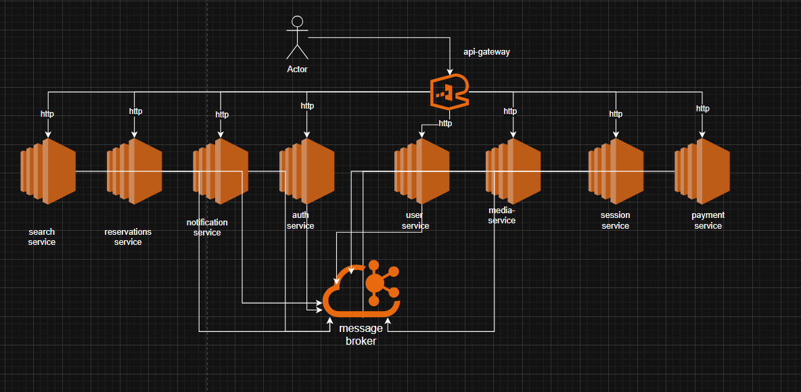

<div align="center">

# 🧘 Yogarian

**A production-ready microservices backend for fitness & yoga session management**

Built with NestJS · Kafka · PostgreSQL · gRPC · Redis · Stripe · Kubernetes

[](https://nestjs.com/)
[](https://www.typescriptlang.org/)
[](https://www.postgresql.org/)
[](https://kafka.apache.org/)
[](https://www.docker.com/)
[](https://kubernetes.io/)

[API Docs (Postman)](https://documenter.getpostman.com/view/45996252/2sBXcLex1Y) · [Architecture Diagrams](#architecture-overview) · [Getting Started](#getting-started)

</div>

---

## 📖 Table of Contents

- [About The Project](#about-the-project)
- [Core Features](#core-features)
- [Architecture Overview](#architecture-overview)
- [Tech Stack](#tech-stack)
- [Services](#services)
- [Communication Patterns](#communication-patterns)
- [Architecture Patterns](#architecture-patterns)
- [Authentication & Authorization](#authentication--authorization)
- [Database Architecture](#database-architecture)
- [Kafka Event System](#kafka-event-system)
- [API Reference](#api-reference)
- [Getting Started](#getting-started)
- [Deployment](#deployment)
- [Project Structure](#project-structure)
- [Architecture Diagrams](#architecture-diagrams)

---

## About The Project

Yogarian is a **microservices-based backend platform** that powers a full fitness/yoga marketplace — connecting trainers who offer sessions with users who discover, book, and pay for them.

It is a **distributed system**: business capabilities are split into independent services, each with its own data store, and coordination happens through asynchronous Kafka events plus targeted gRPC calls.

The platform handles the complete lifecycle:

- **Trainers** create sessions with location, pricing, schedule, and photos
- **Users** discover sessions via search (including proximity-based), follow trainers, and receive notifications
- **Reservations** go through a multi-step orchestrated flow (availability check → Stripe checkout → payment confirmation)
- **Refunds** are fully automated — including bulk refunds when a trainer cancels a session
- **Notifications** are delivered reliably using the outbox pattern with retry support

The system is designed around **10 domain-focused microservices** communicating through **Apache Kafka** events and **gRPC** calls, fronted by a single **API Gateway** for all client traffic.

---

## Core Features

- JWT auth with OTP email verification, role-based access, and Redis-backed token invalidation
- Trainer session lifecycle with scheduling (`UPCOMING → ONGOING → COMPLETED`) and location/media integration
- Reservation and Stripe payment orchestration with automatic refund flows
- Event-driven notifications (welcome, OTP, password reset, session/cancellation alerts)
- Search and discovery endpoints backed by projection sync + PostgreSQL read replica
- Containerized local development and Kubernetes deployment with Helm

---

## Architecture Overview

Architecture is documented in the project diagrams under `docs/`.


[Open in diagrams.net](https://viewer.diagrams.net/?tags=%7B%7D&lightbox=1&highlight=0000ff&edit=_blank&layers=1&nav=1&title=Untitled%20Diagram.drawio&dark=auto#Uhttps%3A%2F%2Fdrive.google.com%2Fuc%3Fid%3D1WyDVpbiQtjmuddxRZL7v7WeZnrCC_yX1%26export%3Ddownload)

> Note: This AWS diagram is a conceptual target cloud architecture (how the platform would look on AWS), not the current live/real infrastructure.



- Editable source: `docs/diagrams.io/arch.diagram.drawio`
- Search architecture: `docs/search/search-arch.png`

### Request Flow

1. **Client** sends HTTP traffic to **api-gateway**
2. **Gateway** authenticates JWT (except allowed public routes) and forwards to target services
3. **Services** emit/consume Kafka events for cross-service workflows

---

## Tech Stack

| Technology | Logo | Purpose |
|:-----------|:----:|:--------|
| **NestJS** |  | Modular backend framework for scalable microservices |
| **TypeScript** |  | Type-safe language across all services and shared libraries |
| **PostgreSQL** |  | Primary relational database (one instance per service) |
| **PostGIS** |  | Geospatial extension for proximity queries (location & search) |
| **Apache Kafka** |  | Event-driven messaging bus for async inter-service communication |
| **Redis** |  | JWT token invalidation, caching, and BullMQ queue backend |
| **gRPC** |  | Synchronous service-to-service RPC (sessions ↔ location) |
| **Stripe** |  | Payment processing, checkout sessions, and automated refunds |
| **TypeORM** |  | ORM for consistent data access across all PostgreSQL databases |
| **BullMQ** |  | Job scheduling (session status transitions, refund timeouts, cleanup) |
| **Nodemailer** |  | Email delivery for notifications (OTP, welcome, alerts) |
| **Cloudinary** |  | Cloud-based image storage for profile and session photos |
| **Docker** |  | Containerized development and deployment |
| **Kubernetes** |  | Orchestrated cluster deployment with Helm charts |
| **Jest** |  | Unit, integration, and end-to-end testing |

---

## Services

| Service | Port | Description |
|:--------|:----:|:------------|
| **api-gateway** | `8000` | Single HTTP entry point — JWT auth, rate limiting, request routing, Redis token invalidation |
| **auth-service** | `8001` | Signup, login, email OTP verification, password reset, account deletion, unconfirmed account cleanup |
| **users-service** | `8002` | User profiles, follow/unfollow relationships, profile updates |
| **media-service** | `8003` | Photo upload/management via Cloudinary — profile photos and multi-photo session uploads with approval |
| **location-service** | `8004` | Geospatial location CRUD (user + session), PostGIS proximity queries, gRPC server on port `50051` |
| **sessions-service** | `8005` | Trainer session lifecycle (CRUD), status scheduling (BullMQ), location via gRPC, refund coordination |
| **payments-service** | `8006` | Stripe checkout creation, webhook handling, payment & refund processing |
| **notifications-service** | `8007` | Email notifications with outbox pattern — welcome, OTP, password reset, session alerts |
| **reservations-service** | `8008` | Reservation lifecycle, availability checks, payment orchestration, individual & bulk refunds |
| **search-service** | `8009` | CQRS read-side — session discovery, user profiles, follower lists, PostgreSQL streaming replication |

---

## Communication Patterns

### HTTP (Client → Gateway → Service)
Standard request/response for all client-facing operations. The API gateway authenticates, rate-limits, and proxies to the correct service.

### Kafka (Service ↔ Service)
45+ event topics for async, eventually-consistent workflows:
- **Domain events** — `user.registered`, `session.created`, `payment.confirmed`
- **Command/Response** — `check.sessions.available.command` / `check.sessions.available.response`
- **Saga coordination** — Multi-step reservation → payment → confirmation flows

### gRPC (Sessions ↔ Location)
Synchronous RPC for atomically creating/updating session locations when a trainer creates or updates a session.

---

## Architecture Patterns

- **Saga pattern**: Reservation and refund workflows are coordinated through Kafka command/response topics and compensating events
- **CQRS pattern**: Command services own writes while `search-service` serves query-centric endpoints
- **Outbox pattern**: `notifications-service` persists email tasks and retries delivery asynchronously
- **Event-driven architecture**: Domain events (`user.*`, `session.*`, `payment.*`, `reservation.*`) drive cross-service reactions
- **Database-per-service**: Each microservice has isolated persistence and schema ownership

---

## Authentication & Authorization

### Flow

```
Signup → Email OTP Sent → Confirm Email → Login → JWT Issued (+ HTTP-only cookie)
                                                        │
                                            ┌───────────┴───────────┐
                                            │   Every Request       │
                                            │   Gateway validates   │
                                            │   JWT + Redis check   │
                                            └───────────────────────┘
```

### JWT Payload
```json
{
  "userId": "uuid",
  "email": "user@example.com",
  "role": "ADMIN | TRAINER | USER",
  "isEmailConfirmed": true
}
```

### Role-Based Access
| Role | Capabilities |
|:-----|:-------------|
| **USER** | Browse sessions, book reservations, follow trainers, manage profile & location |
| **TRAINER** | Everything a user can do + create/update/delete sessions, upload session photos |
| **ADMIN** | Full platform access |

### Security Features
- Passwords hashed with **bcrypt**
- JWT tokens invalidated on logout, password change, and email update via **Redis**
- Rate limiting with named throttle tiers (short, medium, long, sensitive, upload)
- Email confirmation required for sensitive operations (follow, reserve, location)
- Unconfirmed accounts auto-cleaned after timeout (BullMQ)

---

## Database Architecture

Each service owns its data with a dedicated PostgreSQL instance — no shared databases.

| Service | Database | Port | Notes |
|:--------|:---------|:----:|:------|
| auth-service | postgres-auth | `5433` | Credentials, email verification tokens |
| users-service | postgres-users | `5434` | Profiles, follow relationships |
| media-service | postgres-media | `5435` | Photo metadata, Cloudinary references |
| location-service | postgres-location | `5436` | PostGIS geospatial data |
| sessions-service | postgres-sessions | `5437` | Session CRUD, scheduling metadata |
| reservations-service | postgres-reservations | `5438` | Reservation lifecycle |
| search-service (primary) | postgres-search | `5439` | Search service primary database |
| search-service (replica) | postgres-search-slave | `5440` | Streaming replication read replica |
| notifications-service | postgres-notifications | `5441` | Email task outbox, event logs |
| payments-service | postgres-payments | `5442` | Payment records, Stripe IDs |

**Search service** uses PostgreSQL **streaming replication** (WAL-based) with a master-slave setup for read-heavy query workloads.

---

## Kafka Event System

The platform uses **45+ Kafka topics** organized by domain:

<details>
<summary><b>User Events</b></summary>

| Topic | Trigger | Consumers |
|:------|:--------|:----------|
| `user.registered` | User signs up | users, notifications, search |
| `user.deleted` | Account deleted | All services (cascade cleanup) |
| `user.email.updated` | Email changed | users, search |
| `user.profile.updated` | Profile updated | search |
| `user.follow.event` | User follows another | search |
| `user.unfollow.event` | User unfollows | search |

</details>

<details>
<summary><b>Session Events</b></summary>

| Topic | Trigger | Consumers |
|:------|:--------|:----------|
| `session.created` | Trainer creates session | search, notifications |
| `session.updated` | Session details updated | search |
| `session.deleted` | Session removed | search, reservations |
| `session.cancelled` | Session cancelled | search |
| `sessions.ongoing` | BullMQ scheduled transition | search |
| `sessions.completed` | BullMQ scheduled transition | search |

</details>

<details>
<summary><b>Media & Location Events</b></summary>

| Topic | Trigger | Consumers |
|:------|:--------|:----------|
| `image.user.profile.created` | Profile photo uploaded | search |
| `image.user.profile.updated` | Profile photo updated | search |
| `image.user.profile.deleted` | Profile photo deleted | search |
| `images.session.created` | Session photos approved | sessions, search |
| `images.session.deleted` | Session photos removed | sessions, search |
| `user.location.created` | User sets location | search |
| `user.location.updated` | Location updated | search |
| `user.location.deleted` | Location removed | search |

</details>

<details>
<summary><b>Payment & Reservation Events</b></summary>

| Topic | Trigger | Consumers |
|:------|:--------|:----------|
| `payment.confirmed` | Stripe webhook success | reservations, search |
| `payment.failed` | Stripe webhook failure | reservations |
| `reservation.confirmed` | Payment completed | search |
| `reservation.cancelled` | User cancels booking | search, sessions |
| `refund.reservation.confirmed` | Refund completed | reservations, sessions |
| `refund.reservation.failed` | Refund failed | reservations |

</details>

<details>
<summary><b>Commands & Responses (Saga)</b></summary>

| Topic | Flow |
|:------|:-----|
| `check.sessions.available.command / .response` | Reservations → Sessions: Is this session bookable? |
| `create.payment.checkout.command / .response` | Reservations → Payments: Create Stripe checkout |
| `refund.reservation.command / .response` | Reservations → Payments: Process refund |
| `check.session.upcoming.for.refund.command / .response` | Reservations → Sessions: Is session still upcoming? |
| `refund.all.users` / `all.users.refunded` | Sessions ↔ Reservations: Bulk refund on session deletion |

</details>

---

## API Reference

Full endpoint documentation: **[Postman Docs](https://documenter.getpostman.com/view/45996252/2sBXcLex1Y)** · [docs/api-reference.md](docs/api-reference.md)

<details>
<summary><b>Auth</b> — <code>/auth</code></summary>

| Method | Endpoint | Auth | Description |
|:-------|:---------|:----:|:------------|
| POST | `/auth/signup` | Public | Register new account |
| POST | `/auth/login` | Public | Login, receive JWT + cookie |
| POST | `/auth/sendOtp` | ✅ | Request email verification OTP |
| POST | `/auth/confirmEmail` | ✅ | Verify email with OTP |
| POST | `/auth/forgetPassword` | Public | Request password reset email |
| PATCH | `/auth/changePassword/:resetToken` | Public | Reset password with token |
| PATCH | `/auth/updatePassword` | ✅ | Change password (authenticated) |
| PATCH | `/auth/updateEmail` | ✅ ✉️ | Change email (email confirmed) |
| DELETE | `/auth` | ✅ | Delete account |

</details>

<details>
<summary><b>Users</b> — <code>/user</code></summary>

| Method | Endpoint | Auth | Description |
|:-------|:---------|:----:|:------------|
| GET | `/user/:userId` | Public | Get user profile |
| PUT | `/user/me` | ✅ | Update current user profile |
| POST | `/user/follow/:followedId` | ✅ ✉️ | Follow a user |
| DELETE | `/user/unfollow/:followedId` | ✅ | Unfollow a user |

</details>

<details>
<summary><b>Sessions</b> — <code>/sessions</code></summary>

| Method | Endpoint | Auth | Description |
|:-------|:---------|:----:|:------------|
| POST | `/sessions` | ✅ 🏋️ | Create session (trainer only) |
| GET | `/sessions/:id` | Public | Get session details |
| PATCH | `/sessions/:id` | ✅ 🏋️ | Update session (trainer only) |
| DELETE | `/sessions/:id` | ✅ 🏋️ | Delete session + trigger refunds |

</details>

<details>
<summary><b>Reservations</b> — <code>/reservations</code></summary>

| Method | Endpoint | Auth | Description |
|:-------|:---------|:----:|:------------|
| POST | `/reservations/book/:sessionId` | ✅ | Book a session |
| GET | `/reservations/session/:sessionId` | ✅ | Get reservation for a session |
| GET | `/reservations/:requestId` | ✅ | Check reservation status |
| DELETE | `/reservations/:requestId` | ✅ | Cancel reservation |
| DELETE | `/reservations/book/:sessionId` | ✅ | Request refund |

</details>

<details>
<summary><b>Media</b> — <code>/media</code></summary>

| Method | Endpoint | Auth | Description |
|:-------|:---------|:----:|:------------|
| GET | `/media/user/:userId` | Public | Get user profile photo |
| POST | `/media/user` | ✅ | Upload profile photo |
| PATCH | `/media/user` | ✅ | Update profile photo |
| DELETE | `/media/user` | ✅ | Delete profile photo |
| GET | `/media/sessions/:sessionId` | Public | Get session photos |
| POST | `/media/sessions/:sessionId` | ✅ ✉️ | Upload session photos |
| DELETE | `/media/sessions/:sessionId/photos` | ✅ | Delete session photos |

</details>

<details>
<summary><b>Location</b> — <code>/location</code></summary>

| Method | Endpoint | Auth | Description |
|:-------|:---------|:----:|:------------|
| GET | `/location/user` | ✅ ✉️ | Get current user location |
| POST | `/location/user` | ✅ ✉️ | Create user location |
| PATCH | `/location/user` | ✅ ✉️ | Update user location |
| DELETE | `/location/user` | ✅ ✉️ | Delete user location |
| GET | `/location/session/:sessionId` | ✅ | Get session location |

</details>

<details>
<summary><b>Search</b> — <code>/search</code></summary>

| Method | Endpoint | Auth | Description |
|:-------|:---------|:----:|:------------|
| GET | `/search/sessions` | Public | Discover sessions |
| GET | `/search/me` | ✅ | Current user profile projection |
| GET | `/search/sessions/me` | ✅ | My sessions (owned or participated) |
| GET | `/search/followers` | ✅ | My followers |
| GET | `/search/following` | ✅ | Users I follow |
| GET | `/search/follower/:id` | ✅ | Followers of a specific user |
| GET | `/search/trainer/:id` | ✅ | Trainer profile with stats |

</details>

<details>
<summary><b>Payments</b> — <code>/payment</code></summary>

| Method | Endpoint | Auth | Description |
|:-------|:---------|:----:|:------------|
| POST | `/payment/webhook` | Public | Stripe webhook handler |

</details>


---

## Getting Started

### Prerequisites

- **Node.js** 18+
- **Docker** & **Docker Compose**
- **npm**

### Installation

```bash
# Clone the repository
git clone https://github.com/your-username/yogarian.git
cd yogarian

# Install dependencies
npm install
```

### Start Infrastructure

```bash
# Start all infrastructure (PostgreSQL instances, Kafka, Redis, Zookeeper, Mailhog)
docker compose up -d
```

This spins up:
- **9 PostgreSQL** instances (ports 5433–5442)
- **1 PostgreSQL read replica** (port 5440, streaming replication)
- **Kafka** + Zookeeper (port 9093)
- **Kafka UI** (port 8080)
- **Redis** (port 6379)
- **Mailhog** (SMTP: 1025, UI: 8025) — local email testing

### Run Services

```bash
# Start a single service in watch mode
npm run start:dev auth-service

# Start all app services from VS Code tasks
# Run task: dev:all-services
```

For local-only development, prefer the VS Code task in `.vscode/tasks.json`:
- `dev:all-services` runs all services in parallel
- `dev:kill-services` stops all running `start:dev` service processes

For Minikube + Helm deployment, follow **[k8s/helm/readme.md](k8s/helm/readme.md)**.

Background jobs reference: **[docs/bullmq-and-cron-jobs.md](docs/bullmq-and-cron-jobs.md)**.

### Build & Test

```bash
npm run build              # Compile TypeScript
npm run lint               # ESLint + auto-fix
npm run format             # Prettier formatting
npm test                   # Unit tests
npm run test:e2e           # End-to-end tests
npm run test:cov           # Coverage report
npm run proto:generate     # Generate gRPC TypeScript from .proto files
```

---

## Deployment

### Docker

Each service has its own `Dockerfile` in `apps/<service>/Dockerfile`.

### Kubernetes (Helm)

The project includes Helm charts for Kubernetes deployment.
For full Minikube instructions, use **[k8s/helm/readme.md](k8s/helm/readme.md)**.

Quick reference:

```bash
minikube start
minikube tunnel  # Expose gateway LoadBalancer
helm install yoga .\k8s\helm\chart -n yoga --create-namespace
```

---

## Project Structure

```
yogarian/
├── apps/                         # Microservices
│   ├── api-gateway/              # HTTP entry point
│   ├── auth-service/             # Authentication & account lifecycle
│   ├── users-service/            # User profiles & follows
│   ├── media-service/            # Photo management (Cloudinary)
│   ├── location-service/         # Geospatial (PostGIS + gRPC)
│   ├── sessions-service/         # Session CRUD & scheduling
│   ├── payments-service/         # Stripe payments & refunds
│   ├── notifications-service/    # Email notifications (outbox pattern)
│   ├── reservations-service/     # Booking lifecycle & saga orchestration
│   └── search-service/           # CQRS read-side projections
├── libs/                         # Shared libraries
│   ├── common/                   # Auth, DTOs, events, types, rate limiting
│   ├── database/                 # TypeORM config, base repository
│   └── kafka/                    # Kafka topics (45+), module setup
├── docker/                       # Docker configs
│   └── postgres/search/          # Streaming replication scripts
├── k8s/helm/                     # Kubernetes Helm charts
├── docs/                         # Architecture diagrams & API reference
├── scripts/                      # Utility & performance scripts
├── docker-compose.yaml           # Local infrastructure (12+ containers)
├── nest-cli.json                 # NestJS monorepo configuration
└── package.json                  # Root dependencies & scripts
```

---

## Architecture Diagrams

Detailed architecture and sequence diagrams are available in the `docs/` directory:

| Diagram | Path |
|:--------|:-----|
| High-Level Architecture | `docs/high-level-arch.png` |
| Full Architecture (editable) | `docs/diagrams.io/arch.diagram.drawio` |
| Search Architecture | `docs/search/search-arch.png` |
| Creating Sessions Sequence | `docs/sessions/creating-sessions.sequence.diagram.png` |
| Delete Session Sequence | `docs/sessions/delete-session.sequnce.daigram.png` |
| Reservation Flow | `docs/reservations & payment/create-reservation-full.sequnce.diagram.svg` |
| Reservation States | `docs/reservations & payment/reservation.state.diagram.png` |
| Payment States | `docs/reservations & payment/payment.state.diagram.png` |
| Notifications Architecture | `docs/notifications/notifications-high-level-arch.diagram.png` |